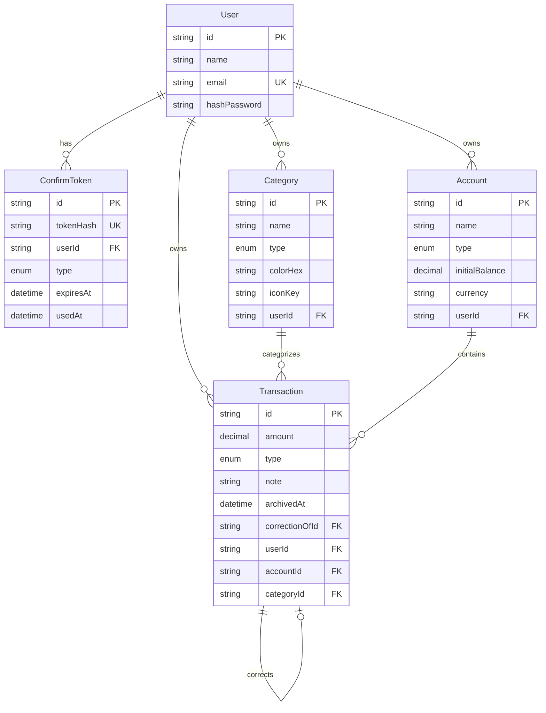

# Finance Tracker

Pet-project built to learn NestJS in practice — REST API for tracking personal
income/expenses with immutable transaction history.

## Stack

NestJS, Prisma, PostgreSQL, TypeScript, JWT auth, class-validator, Swagger

## Features

- JWT auth (access + refresh tokens via httpOnly cookie)
- Email verification & password reset flow
- Categories, Accounts, Transactions CRUD
- Immutable transaction corrections (self-relation: original -> correction)
- Swagger documentation
- Response serialization via ClassSerializerInterceptor + Entity classes

## Data Model

## Getting Started

1. Clone the repo: `git clone https://github.com/KirillPitomets/Finance-Tracker.git`
2. Copy `.env.example` to `.env` and fill in the values
3. Start Postgres: `docker-compose up -d`
4. Install dependencies: `npm install`
5. Run migrations: `npx prisma migrate dev`
6. Seed the database (optional): `npx prisma db seed`
7. Start the app: `npm run start:dev`
8. Swagger docs available at `http://localhost:3000/docs`

## Architecture notes

- Immutable transactions: corrections create a new record instead of mutating
  the original, linked via `correctionOfId` self-relation on the Transaction model

## Known limitations / TODO

- [ ] Support traversing the full correction chain of a transaction via
      `correctionOf`/`correctedBy` (currently only one level: original -> correction)

## Notes

This project was primarily built to get hands-on experience with NestJS
architecture (modules, DI, guards, interceptors) and Prisma. It's not intended
to be a production-ready finance app.
